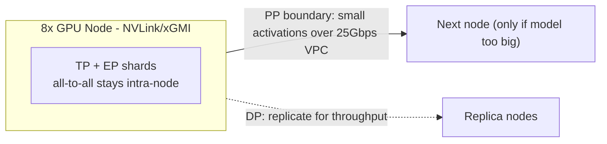
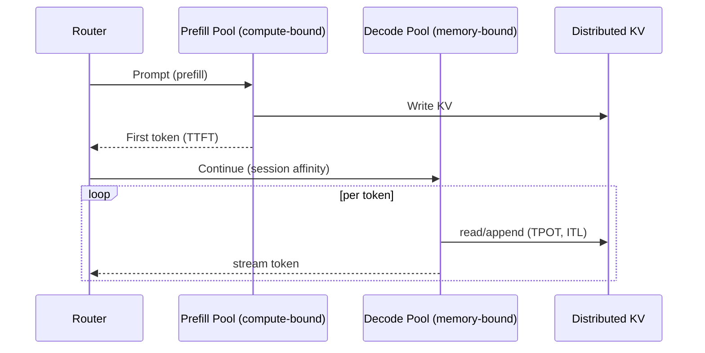

# Inference Optimization Architecture for the Agentic Inference Cloud

**Scope.** A production-grade performance architecture for a flagship, multi-tenant inference
endpoint that concurrently serves three workload classes - large Mixture-of-Experts (MoE) models
(200B+ params), dense long-context reasoning models, and small quantized draft models - across a
heterogeneous fleet of NVIDIA (H200/B300) and AMD (MI300X/MI325X/MI350X) nodes in 1x and 8x slugs,
with NVLink/xGMI intra-node and 25 Gbps inter-node VPC networking.

**Optimization objective.** Maximize **tokens/sec/dollar** subject to per-tier latency SLOs
(TTFT, TPOT/ITL) and a per-model **quality floor**, without ever crossing a tenant isolation
boundary. Every decision below is justified against that objective.

> **Key terms (full list in [`GLOSSARY.md`](GLOSSARY.md)).**
> *Prefill* = reads the whole prompt, compute-bound, sets **TTFT** (time to first token).
> *Decode* = generates tokens one-by-one, memory-bound, sets **TPOT** (time per output token); **ITL** is the per-token gap.
> *KV cache* = saved per-token state so decode doesn't recompute the conversation; lives in **HBM** (big/slow) vs **SRAM** (tiny/fast).
> *Quantization* = fewer bits per number (FP8/INT8/FP4) for speed/memory, at some accuracy risk.
> *MoE* = huge model of many *experts*; a *router* activates only a few per token.
> *TP/PP/DP/EP* = tensor / pipeline / data / expert parallelism (ways to split a model across GPUs).

---

## 1. Design Principles & Workload Taxonomy

Three workloads have fundamentally different bottlenecks, so we tune them separately rather than
applying one config fleet-wide:

| Workload | Dominant bottleneck | Primary lever | SLO emphasis |
|---|---|---|---|
| MoE 200B+ | Memory capacity + all-to-all routing traffic | Expert Parallelism, FP8/FP4 expert weights, intra-node placement | Throughput, tokens/sec/$ |
| Dense long-context reasoning | Attention memory (KV) + HBM bandwidth | FlashAttention, chunked prefill, KV quantization | TTFT on long prompts, TPOT |
| Small quantized draft | Latency / launch overhead | Co-location as speculator for big models | ITL |

Two cross-cutting principles drive the architecture: **(a) separate the two phases of generation**
(prefill is compute-bound, decode is memory-bound - they should not share a machine config), and
**(b) keep chatty communication inside a node** (NVLink/xGMI is ~10-100x the 25 Gbps inter-node
fabric, so the parallelism plan is fundamentally a communication-placement problem).

---

## 2. Kernel & Precision Engineering

### 2.1 Precision strategy (a tiered "precision ladder")

We do not pick one numeric format; we apply the lowest precision each tensor can tolerate while
holding the quality floor, validated by an offline accuracy-regression suite (perplexity +
task-level evals) gated in CI.

| Component | Default precision | Rationale / guardrail |
|---|---|---|
| MoE expert FFN weights | **FP8** (E4M3); **MXFP4** experimental on B300/MI350X | Experts are the bulk of params and the most error-tolerant; FP4 only behind per-layer sensitivity analysis + eval gate |
| Attention QK/softmax | BF16/FP16 accumulate | Softmax + scores are precision-sensitive; cheap relative to FFN |
| Router / gating | BF16 | A misrouted token is a large, non-local error; never quantize aggressively |
| KV cache | **FP8** (optionally INT8 per-channel) | Halves KV memory -> larger batch / longer context; small, measurable quality cost |
| Final logits / LM head | BF16 | Protects sampling distribution and reasoning accuracy |
| Activations (GEMM in) | FP8 dynamic per-tensor scaling | Pairs with FP8 weights to hit tensor-core peak |

**Why FP8 first, FP4 cautiously.** FP8 on Hopper/Blackwell and MI300-class hardware roughly doubles
math throughput and halves weight/KV memory traffic versus BF16 with minimal, well-characterized
quality loss. FP4/MXFP4 can double throughput again but risks reasoning degradation; we gate it to
expert weights only and require it to pass the same eval bar as the FP8 baseline before promotion.

### 2.2 Compute & memory access (SRAM vs HBM)

The decode phase is **memory-bound**: the GPU spends most cycles waiting on HBM, not computing. So
the dominant lever is reducing HBM traffic and maximizing arithmetic intensity (a roofline analysis
guides which kernels are worth tuning):

- **Fused attention (FlashAttention-style):** tile attention so QK/softmax/AV stay resident in SRAM,
  avoiding materializing the full attention matrix in HBM. Essential for long context, where the
  naive O(n^2) memory blows up.
- **Paged KV cache:** manage KV in fixed-size pages to eliminate fragmentation, enabling larger
  effective batch sizes (more tokens/sec/$). KV in FP8 further extends context length per GB of HBM.
- **Long-context tactics:** chunked prefill (process huge prompts in segments to bound peak memory
  and interleave with decode), plus KV compression and, where the model permits, sliding-window /
  attention-sink to cap KV growth.
- **Operator fusion:** fuse epilogues (bias, activation, scaling, all-reduce where possible) to cut
  kernel-launch overhead and round-trips to HBM.

### 2.3 Custom kernels and the NVIDIA/AMD portability problem

CUDA kernels do not run on ROCm, so a naive approach doubles engineering cost. Strategy: keep a
**single source of truth in Triton** (which targets both NVIDIA and AMD backends) for the kernels we
maintain - fused MoE grouped-GEMM with token routing, quantized GEMMs, fused attention variants -
and fall back to vendor libraries (CUTLASS on NVIDIA, Composable Kernel/hipBLASLt on AMD) where they
already win. All custom kernels are autotuned per architecture (tile sizes, pipeline depth) and
gated by a microbenchmark + numerical-parity test before deployment.

---

## 3. Distributed Inference & Execution Orchestration

### 3.1 Parallelism strategy (a communication-placement problem)

The interconnect hierarchy dictates the mapping: **chatty collectives stay intra-node; only small,
latency-tolerant transfers cross the 25 Gbps fabric.**

| Technique | What it splits | Communication cost | Placement rule |
|---|---|---|---|
| **Tensor (TP)** | Each layer's matmuls | High (all-reduce per layer) | **Intra-node only** (NVLink/xGMI) |
| **Expert (EP)** | MoE experts across GPUs | High (all-to-all per MoE layer) | **Intra-node preferred**; cross-node only if forced |
| **Pipeline (PP)** | Layer ranges across stages | Low (activations at stage boundary) | **Use to cross nodes** to fit 200B+ |
| **Data (DP)** | Whole replicas | None (independent requests) | Scale out for throughput |

**Per-workload mapping:**

- **MoE 200B+ (8x node):** TP + EP within the node so all-to-all expert routing rides NVLink/xGMI;
  PP only to span a second node if the model doesn't fit in one; DP to add replicas. This keeps the
  expensive all-to-all off the slow VPC fabric.
- **Dense long-context (8x node):** TP=8 intra-node; DP for replicas. PP added only if a single node
  can't hold weights + the large long-context KV.
- **Draft model (1x node):** runs unsharded as a speculator co-located near the target model.

### 3.2 Disaggregated prefill/decode

Prefill (compute-bound, bursty, sets TTFT) and decode (memory-bound, sustained, sets TPOT) have
opposite resource profiles. Co-locating them forces a bad compromise and lets long prefills stall
ongoing decodes (head-of-line blocking). We run **separate prefill and decode pools**, each sized
and tuned independently, and transfer the prompt's KV from prefill to decode over the fastest
available path (intra-node or RDMA). Benefits: TTFT and TPOT scale independently; we can use
higher-FLOP nodes for prefill and higher-bandwidth/larger-HBM nodes for decode; and continuous
batching on the decode pool is no longer disrupted by prefill spikes.

### 3.3 KV-cache management, caching, and continuous batching

- **Distributed paged KV** across a tier (GPU HBM -> CPU RAM -> NVMe): hot sessions stay in HBM;
  cooler sessions spill to slower tiers and are paged back on the next turn, freeing HBM for batch.
- **Prefix / prompt caching:** shared prefixes (system prompts, tool schemas, RAG context) are
  computed once and reused, a major TTFT win for agentic workloads - **strictly per-tenant
  namespaced** (see §5). 
- **Continuous batching:** new requests are slotted onto the decode pool as others finish, keeping
  GPUs saturated; this is the single biggest tokens/sec/$ lever for mixed traffic.
- **Mitigating latency compounding in agents:** multi-turn agents chain many calls, so per-call
  overhead compounds. We use **session affinity** (route follow-ups to the node that already holds
  the session KV) plus prefix-cache reuse so each turn pays near-zero re-prefill cost.

---

## 4. Infrastructure Resiliency & Observability

### 4.1 Cold-start mitigation for 100GB+ models

Streaming a 100GB+ model from object storage over the network on every scale-up is fatal to
latency. We attack it with a **hierarchical weight cache** and warm pooling:

- **Tiered weights:** local NVMe -> node RAM/page cache -> regional object store; resolve from the
  fastest tier that has the model (see diagram 4 in [`docs/diagrams.md`](docs/diagrams.md)).
- **Fast load path:** `mmap`/lazy loading and direct-to-HBM streaming (e.g., GPU-direct storage) so
  weights page in on demand rather than via a full blocking copy.
- **Warm pools + snapshot/restore:** keep popular models resident; snapshot a ready GPU memory state
  and restore it to skip re-initialization.
- **Predictive autoscaling + memory pooling:** forecast demand to pre-warm capacity ahead of load,
  and pool memory across replicas so a model stays warm even as individual replicas cycle.

### 4.2 Telemetry & benchmarking framework

We instrument and **define the KPIs precisely** so they are enforceable, not aspirational:

| KPI | Definition | Primary driver |
|---|---|---|
| **TTFT** | request arrival -> first token emitted | prefill compute, prefix-cache hit rate, queueing |
| **TPOT** | mean inter-token time during decode | HBM bandwidth, batch size, KV size |
| **ITL** | per-token gap distribution (p50/p99) | batching jitter, scheduling, paging stalls |
| **Tokens/sec/$** | served output tokens / (GPU-hour cost) | utilization x throughput at fixed quality |

- **Low-level profiling:** Nsight Systems/Compute (NVIDIA) and rocprof/Omnitrace (AMD), plus a
  **roofline** per kernel to confirm whether we're compute- or memory-bound before optimizing.
- **Methodology:** report **distributions (p50/p95/p99), not averages**, under realistic mixed load
  (varied prompt/decode lengths, concurrency sweeps); always pair latency with a quality eval so we
  never "win" TTFT by silently dropping quality.
- **Regression gates in CI:** a change merges only if it does not regress KPI p99 or the accuracy
  floor; nightly load tests track tokens/sec/$ per model x hardware SKU to drive placement decisions.

---

## 5. Multi-Tenant Security (cross-cutting constraint)

Performance optimizations must never leak across tenants:

- **No cross-tenant cache reuse:** prefix/prompt and KV caches are namespaced per tenant; identical
  text from different tenants is never shared. We accept the lost cache efficiency as a hard
  security requirement.
- **Isolation of state:** KV cache memory is zeroed/reclaimed on session end; tenants do not share a
  model replica's live KV space in a way that allows readback.
- **Placement constraints:** scheduling respects tenant/region/compliance boundaries; co-location
  policies prevent noisy-neighbor and side-channel exposure on shared nodes.

---

## 6. Trade-offs & Recommended Defaults

| Decision | Aggressive | Conservative | Recommended default |
|---|---|---|---|
| Expert weight precision | MXFP4 | BF16 | **FP8**, FP4 only after eval gate on B300/MI350X |
| KV cache precision | INT8/FP8 | BF16 | **FP8** (INT8 per-channel if quality holds) |
| Cross-node EP for MoE | Yes | Never | **Avoid**; keep EP intra-node, PP across nodes |
| Prefill/decode placement | Co-located (simple) | Disaggregated (complex) | **Disaggregated** for flagship SLOs |
| Prefix cache sharing | Cross-tenant (fast) | None | **Per-tenant only** (security non-negotiable) |
| Cold-start strategy | Stream on demand | Always warm everything | **Hierarchical cache + predictive warm pools** |

**Summary.** The architecture extracts maximum tokens/sec/dollar by (1) applying the lowest safe
precision per tensor with eval gates, (2) keeping chatty TP/EP traffic intra-node while using PP/DP
to scale across the slow fabric, (3) disaggregating prefill and decode so each phase is tuned and
scaled independently with continuous batching and prefix reuse, and (4) eliminating cold-start
latency through hierarchical caching and predictive warming - all under strict per-tenant isolation,
with KPIs enforced by low-level profiling and CI regression gates.
