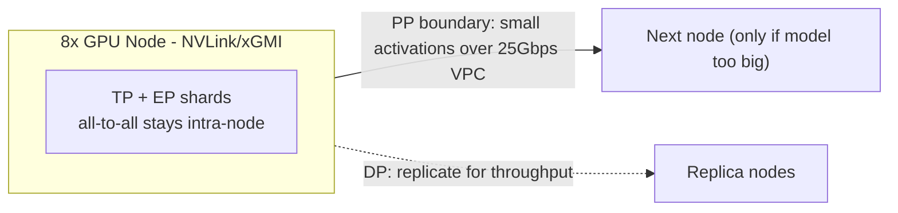
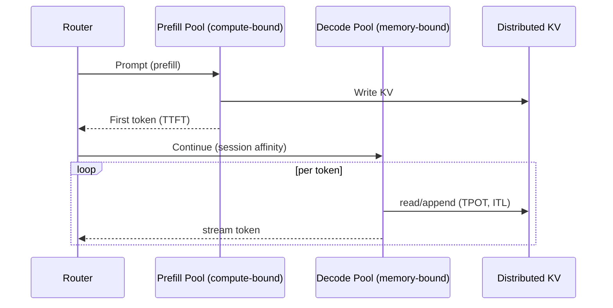
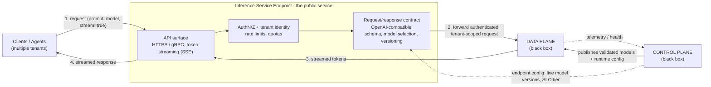

# Inference Optimization Architecture for the Agentic Inference Cloud

**What this is.** A plan for running a flagship AI inference service (using trained models to answer
live requests) that many customers share at once. It serves three kinds of models at the same time:
giant Mixture-of-Experts models (MoE - one big model made of many smaller "expert" sub-models, 200B+
in size), dense long-context reasoning models (regular models that read very long prompts), and a
small fast model (used both as its own cheap service and as a helper that speeds up the big ones). It
runs on a mixed fleet of NVIDIA (H200/B300) and AMD (MI300X/MI325X/MI350X) machines, in servers with
either 1 or 8 GPUs ("1x and 8x slugs"), connected by a very fast link inside each server
(NVLink/xGMI) and a much slower 25 Gbps network between servers.

**The goal.** Get the most useful output per dollar (**tokens/sec/dollar**) while still hitting our
speed promises (how fast the first word appears and how fast the rest stream out) and a minimum
quality bar for answers - and never letting one customer's data leak into another's. Every choice
below is judged against that goal.

> **Quick word key (full list in [`GLOSSARY.md`](GLOSSARY.md)).**
> *Prefill* = the model reads your whole prompt at once; this sets **TTFT** (how long until the first word).
> *Decode* = the model writes the answer one word-piece at a time; this sets **TPOT** (time per output word-piece). **ITL** is the gap between word-pieces.
> *Token* = a word-piece, the unit models read and write (~3/4 of a word).
> *KV cache* = saved work so the model doesn't re-read the whole conversation for each new word-piece. It sits in **HBM** (large but slow GPU memory) and we want to use **SRAM** (tiny but very fast memory) where possible.
> *Quantization* = storing the model's numbers with fewer bits (FP8/INT8/FP4) to go faster and use less memory, at some risk to accuracy.
> *TP/PP/DP/EP* = four ways to split a model across GPUs (tensor / pipeline / data / expert).

> For the platform that turns a model into a served endpoint - the control plane (model setup
> lifecycle and CI/validation gates) and the data plane (serving path) - see
> [`SYSTEM_DESIGN.md`](SYSTEM_DESIGN.md).

---

## 1. Design Principles & Workload Taxonomy

The three kinds of models we serve are slow for different reasons, so we tune each one separately
instead of forcing a single setup on the whole fleet (for the full per-model precision and
memory-technique recipe, see §2.4):

| Model type | Its main bottleneck | Main fix we apply | What matters most |
|---|---|---|---|
| Giant MoE (200B+) | Too big to store, and its experts have to talk to each other a lot (all-to-all traffic) | Spread experts across GPUs (expert parallelism), shrink them with fewer-bit numbers (FP8/FP4), keep them inside one server | Serving many users cheaply (tokens/sec/$) |
| Dense long-context reasoning | The memory to remember a long conversation (KV cache) gets huge, and the GPU waits a lot on slow memory (HBM) | Memory-smart attention (FlashAttention), read long prompts in chunks, store the cache in fewer bits | Fast first word on long prompts (TTFT) and steady streaming (TPOT) |
| Small model - as its own service | Keeping cheap machines busy and avoiding per-request overhead | Many copies on cheap 1-GPU machines (data parallelism), pack requests together tightly, route easy requests here | Fast first word + cheap output (TTFT, tokens/sec/$) |
| Small model - as a speed helper | Per-request overhead / latency | Park it next to a big model and let it guess ahead (speculative decoding) | Tiny gaps between word-pieces (ITL) |

The small model does **two jobs**: it answers easy requests directly as the cheapest option, *and*
it speeds up the big models by guessing their next words for them (more in §3.4). The quality we need
from it differs by job, which we explain in §2.1.

Two ideas guide everything below:
**(a) Split the two phases of answering.** Reading the prompt (prefill) needs raw math power, while
writing the answer (decode) mostly waits on memory - opposite needs, so they should not share the
same machine setup.
**(b) Keep the chatty work inside one server.** The link inside a server is roughly 10-100x faster
than the network between servers, so the whole "how do we split the model" question is really "what
do we keep together so the heavy back-and-forth stays on the fast link."

---

## 2. Kernel & Precision Engineering

### 2.1 Precision strategy (how many bits we use for the numbers)

We don't pick one number format for everything. For each part of the model we use the fewest bits it
can handle without dropping below our quality bar, and we prove it's safe with an automatic
accuracy-test suite that runs before any change ships (gated in CI).

| Part of the model | Bits we use by default | Why / safety check |
|---|---|---|
| MoE expert weights (the bulk of the model) | **FP8**; **FP4** (MXFP4) tried on the newest chips (B300/MI350X) | Experts are most of the size and the most forgiving; we only allow 4-bit after a per-layer sensitivity check and an accuracy test |
| Attention scores (the "what relates to what" step) | 16-bit (BF16/FP16) | This step is sensitive to rounding and is cheap anyway, so we don't skimp |
| Router (the part that picks which experts to use) | 16-bit (BF16) | A wrong pick here is a big mistake, so we never aggressively shrink it |
| KV cache (saved conversation memory) | **FP8** (or INT8 in some cases) | Halves the memory, so we fit bigger batches / longer conversations, for a small, measured quality cost |
| Final output layer | 16-bit (BF16) | Protects the quality of the actual words chosen |
| Activations (numbers flowing through math steps) | FP8 with automatic scaling | Pairs with FP8 weights to hit top GPU math speed |

**Why FP8 first, FP4 carefully.** On current chips, 8-bit (FP8) roughly doubles math speed and halves
memory traffic versus 16-bit, with little, well-understood quality loss. 4-bit (FP4) can double speed
again but can make the model noticeably worse at reasoning, so we limit it to the most forgiving part
(expert weights) and only after it passes the same accuracy tests as FP8.

**How much we can shrink the small model depends on its job.** When the small model is a *speed
helper* (speculator), the big model double-checks every word it guesses - so a rounding mistake only
means a few wasted guesses (a bit less speedup), never a wrong answer. We can shrink it hard (FP4).
When the small model is its *own customer-facing service*, its words go straight to the user, so it
has to meet its own quality bar and we shrink it more carefully (FP8, and FP4 only if it passes the
tests). Same model file, two different settings.

### 2.2 Compute & memory access (fast tiny memory vs. big slow memory)

While writing the answer (decode), the GPU mostly sits waiting on its big slow memory (HBM) rather
than doing math - so the main win is cutting trips to that memory. (A "roofline" check tells us
whether a given step is limited by math or by memory, so we know what's worth tuning.)

- **Memory-smart attention (FlashAttention-style):** do the attention math in small tiles that stay
  in the fast tiny memory (SRAM) instead of writing the whole giant table out to slow memory.
  Essential for long prompts, where the naive approach uses memory that grows with the square of the
  length.
- **Paged KV cache:** store the saved conversation memory in small fixed-size pages (like how an
  operating system manages RAM) so none is wasted, which lets us run bigger batches (more
  tokens/sec/$). Storing it in FP8 stretches how long a conversation fits per GB.
- **Long-prompt tricks:** read huge prompts in chunks (chunked prefill) to cap peak memory, compress
  the saved memory, and - where the model allows - only keep recent tokens (sliding-window) to stop
  the memory from growing forever.
- **Combining steps (operator fusion):** merge small follow-on operations into one so we cut the
  overhead of launching many tiny GPU programs and avoid extra round-trips to slow memory.

### 2.3 Custom kernels and the NVIDIA-vs-AMD problem

A "kernel" is a small, highly tuned program that runs one operation on the GPU. The catch: programs
written for NVIDIA (CUDA) don't run on AMD (ROCm), so doing everything twice would double the work.
Our approach: write the kernels we maintain *once* in **Triton** (a tool that can target both NVIDIA
and AMD) - the heavy MoE math, the fewer-bit matrix multiplies, and the attention variants - and lean
on each vendor's ready-made libraries (CUTLASS on NVIDIA, Composable Kernel on AMD) where those are
already faster. Every custom kernel is auto-tuned for each chip and must pass a speed test and a
"same numbers as before" correctness test before it ships.

### 2.4 Per-model recipe

The sections above are organized by *component* (precision) and by *technique* (memory). This table
flips that around and lists, for each model type, the precision settings (§2.1) and the compute and
memory techniques (§2.2) we actually apply. Two rules of thumb hold across all of them: protect the
sensitive parts (router, final layer) at 16-bit, and FlashAttention + paged KV help everything.

| Model type | Precision strategy (§2.1) | Compute & memory techniques (§2.2) |
|---|---|---|
| **Giant MoE (200B+)** | Expert weights **FP8** (FP4 experimental on newest chips, gated by tests); router **BF16** (never skimp); attention **BF16**; KV cache **FP8**; final layer **BF16** | Fused MoE kernel (grouped-GEMM); FlashAttention; **paged KV** in FP8; operator fusion. Long-prompt tricks only if it also serves long context |
| **Dense long-context reasoning** | Weights **FP8**; attention **BF16**; KV cache **FP8** (INT8 if quality holds); final layer **BF16** | Heaviest user of §2.2: FlashAttention (essential), **chunked prefill**, KV compression, sliding-window/attention-sink where allowed, paged KV |
| **Small model - standalone service** | **FP8** (conservative; FP4 only if it passes the accuracy gate, since users see its output) | Paged KV; **continuous batching** to pack requests; high replica count. Rarely needs long-prompt tricks |
| **Small model - speculator** | **FP4 aggressive** (the big model verifies every token, so errors only cost a little speed, never correctness) | Lightweight and co-located with the target model; the gain comes from speculative decoding, not memory tricks |

Note on the small model: it is the *same checkpoint* deployed twice with different precision profiles,
because its tolerable precision depends on whether a user sees its output (standalone) or the big
model verifies it (speculator) - see the role discussion in §2.1.

---

## 3. Distributed Inference & Execution Orchestration

### 3.1 Parallelism strategy (how we split a model across GPUs)

Because the link inside a server is far faster than the network between servers, the rule is simple:
**keep the heavy back-and-forth inside one server; only small, occasional messages may cross between
servers.**

| Way to split | What it splits up | How chatty it is | Where to use it |
|---|---|---|---|
| **Tensor (TP)** | One layer's math, shared across GPUs | Very chatty (every layer) | **Inside one server only** (fast link) |
| **Expert (EP)** | MoE experts spread across GPUs | Very chatty (every MoE layer) | **Inside one server** if possible; across servers only if forced |
| **Pipeline (PP)** | Early layers on one server, later layers on another | Light (only at the hand-off) | **Use it to cross servers** when a model is too big for one |
| **Data (DP)** | Full copies, each handling different requests | Not chatty (copies are independent) | Add copies to serve more users |

**What we do for each model:**

- **Giant MoE (8-GPU server):** split the math (TP) and the experts (EP) inside the server, so the
  heavy expert-to-expert chatter stays on the fast link; only add a second server (PP) if the model
  doesn't fit in one; add copies (DP) for more users. This keeps the expensive chatter off the slow
  network.
- **Dense long-context (8-GPU server):** split the math across all 8 GPUs (TP); add copies (DP) for
  more users; only add a second server (PP) if the model plus its big conversation memory won't fit.
- **Small model (1-GPU machine):** runs whole on one GPU with many copies. The same model file is
  deployed two ways - a fleet of cheap copies serving customers directly, and helper copies sitting
  next to the big models to speed them up.

### 3.2 Splitting prompt-reading from answer-writing (disaggregated prefill/decode)

Reading the prompt (prefill) is bursty and needs math power; writing the answer (decode) is steady
and needs fast memory - opposite profiles. If they share a machine, neither runs well, and a big
prompt can stall everyone else's in-progress answers (a traffic jam). So we run **two separate pools
of machines**, each tuned for its job, and pass the prompt's saved memory (KV cache) from the
reading pool to the writing pool over the fastest path available. The payoff: we can speed up "first
word" and "streaming" independently, use the right hardware for each, and keep the writing pool busy
without prompt bursts disrupting it.

### 3.3 Managing saved memory, reusing work, and packing requests

- **Tiered saved memory (paged KV):** keep active conversations in the fast GPU memory (HBM); push
  quieter ones down to slower storage (CPU RAM, then disk) and pull them back when the user returns -
  freeing room to serve more requests at once.
- **Reusing shared beginnings (prefix caching):** many requests start the same way (a shared
  instruction block, tool definitions, reference text). Compute that once and reuse it - a big win
  for "first word" speed. We keep each customer's cache strictly separate (see §5).
- **Packing requests together (continuous batching):** slot new requests onto the writing pool as
  old ones finish, so GPUs are never idle. This is the single biggest lever for cheap output.
- **Stopping delays from piling up:** AI "agents" make many calls in a row, so small per-call delays
  add up. We send a user's follow-ups back to the machine that already holds their saved memory
  (session affinity) and reuse the shared beginnings, so each step barely pays to re-read anything.

### 3.4 Sending each request to the right-sized model (routing & cascade)

Matching how hard a request is to how expensive a model is happens to be one of the biggest
cost-savers, so the router does more than balance load - it picks *which model* should answer:

- **Route by difficulty:** a cheap check (often the small model itself) guesses how hard a request
  is and sends easy ones (short questions, sorting, pulling out facts, autocomplete) to the **cheap
  small-model service**, saving the expensive big models for requests that truly need them.
- **Try cheap first, escalate if unsure (cascade):** for unclear cases, the small model answers first
  and reports how confident it is; low-confidence answers get **escalated** to a bigger model. This
  keeps cost low on the easy majority while protecting quality on the hard few - the trade-off is
  extra delay on the escalated ones, so we tune the confidence threshold per speed promise.
- **Reuse as a speed helper:** when a request does go to a big model, that same small model speeds it
  up by guessing ahead (speculative decoding). One small model, two ways to save money.
- **Guardrails:** we log and measure routing (how often the cheap answer is accepted, how often we
  escalate, and the quality difference vs. always using the big model), and routing never crosses
  customer boundaries.

---

## 4. Infrastructure Resiliency & Observability

### 4.1 Avoiding slow startups for 100GB+ models

Downloading a 100GB+ model over the network every time we add a machine would make users wait far too
long. We fight this with a **layered cache** of the model files plus keeping machines "warm":

- **Layers of storage, fastest first:** local fast disk (NVMe) -> the server's RAM -> a regional file
  store; we load from the fastest layer that has the model (see diagram 4 in
  [`docs/diagrams.md`](docs/diagrams.md)).
- **Fast loading:** stream the model straight into GPU memory and load pieces only as needed, instead
  of one big blocking copy.
- **Keep machines warm / snapshots:** keep popular models loaded and ready; save a ready-to-go memory
  snapshot and restore it instead of starting from scratch.
- **Scale ahead of demand:** predict busy periods and warm up machines *before* the rush, and share
  memory across copies so a model stays ready even as individual copies recycle.

### 4.2 Measuring and proving performance (telemetry & benchmarking)

We measure everything and **define our targets precisely** so they're enforceable, not vague:

| Metric | What it means (plainly) | What mainly drives it |
|---|---|---|
| **TTFT** | Time until the first word appears | Prompt-reading speed, reuse of shared beginnings, waiting in line |
| **TPOT** | Average time per word-piece while streaming | GPU memory speed, batch size, size of saved memory |
| **ITL** | The gap between word-pieces (we track typical and worst-case) | Batching jitter, scheduling, memory stalls |
| **Tokens/sec/$** | Output produced per dollar of GPU time | How busy we keep the GPUs, at a fixed quality |

- **Deep profiling:** vendor tools (Nsight on NVIDIA, rocprof on AMD) show exactly what the GPU is
  doing, and a "roofline" check tells us whether a step is limited by math or memory before we try to
  optimize it.
- **Honest measuring:** report the spread (typical, bad, and worst-case - p50/p95/p99), not just
  averages, under realistic mixed traffic; and always check quality alongside speed so we never "win"
  on speed by quietly getting worse answers.
- **Automatic gates:** a change only ships if it doesn't make worst-case speed or accuracy worse, and
  nightly tests track cost-efficiency per model and chip to guide where we run things.

---

## 5. Multi-Tenant Security (the rule that applies everywhere)

Speed tricks must never leak one customer's data into another's:

- **Never share caches across customers:** each customer's reused beginnings and saved memory are
  kept separate; even if two customers send identical text, we never share. We accept the lost
  efficiency as a hard requirement.
- **Clean up memory:** saved conversation memory is wiped/reclaimed when a session ends, and
  customers can't read into each other's live memory.
- **Careful placement:** scheduling respects customer, region, and compliance boundaries, and we
  avoid setups where sharing a machine could leak information.

---

## 6. Trade-offs & Recommended Defaults

| Decision | Aggressive option | Safe option | What we recommend |
|---|---|---|---|
| Bits for expert weights | 4-bit (MXFP4) | 16-bit (BF16) | **8-bit (FP8)**; 4-bit only after it passes accuracy tests on the newest chips |
| Bits for saved memory (KV) | INT8/FP8 | 16-bit (BF16) | **FP8** (INT8 if quality holds) |
| Spread MoE experts across servers? | Yes | Never | **Avoid**; keep experts inside one server, only span servers with pipelining |
| Read-prompt vs. write-answer machines | Same machines (simpler) | Separate machines (more complex) | **Separate**, to hit our speed promises |
| Share reused beginnings across customers | Yes (faster) | Never | **Never across customers** (security comes first) |
| Small model's role | Only its own service | Only a speed helper | **Both** - cheap service + speed helper, fed by smart routing (§3.4) |
| Routing strategy | Always try cheap then escalate | Always use the big model | **Route by difficulty + escalate when unsure**, tuned per speed promise |
| Startup strategy | Download on demand | Keep everything warm | **Layered cache + warm up ahead of demand** |

**In short.** We get the most output per dollar by (1) using the fewest safe bits for each part of
the model, checked by automatic tests; (2) keeping the chatty work inside one server and only
crossing servers with light traffic; (3) splitting prompt-reading from answer-writing so each is
tuned on its own, with tight request packing and reuse of shared beginnings; (4) sending each request
to the right-sized model and reusing the small model as a speed helper; and (5) avoiding slow
startups with a layered cache and warming up ahead of demand - all while keeping every customer's
data fully separate and proving our numbers with deep profiling and automatic quality/speed gates.

---

## 7. The Inference Service Endpoint

Pulling it together: the endpoint is the only thing customers see. It is a thin, stateless front
door - the heavy lifting stays in the data plane, and all configuration comes from the control plane.
Here both planes are drawn as black boxes (their internals are covered in
[`SYSTEM_DESIGN.md`](SYSTEM_DESIGN.md)); the focus is the endpoint itself.

The endpoint's real jobs are **identity and contract** - authenticate the caller, attach a trusted
tenant identity, enforce quotas, validate the request, pick the requested model/version, and stream
tokens back. It performs no inference itself: it forwards each authenticated, tenant-scoped request
to the data plane and relays the streamed tokens to the client. The control plane feeds both sides -
publishing validated models and config to the data plane, and telling the endpoint which model
versions are live and at what SLO tier. This separation keeps the public surface stable even as
models and infrastructure change behind it.

A Java/Spring Boot skeleton illustrating this endpoint's structure (OpenAI-compatible API, auth and
tenancy, SSE streaming, and black-box boundaries to the data and control planes) lives in
[`examples/inference-endpoint-java/`](examples/inference-endpoint-java/).
