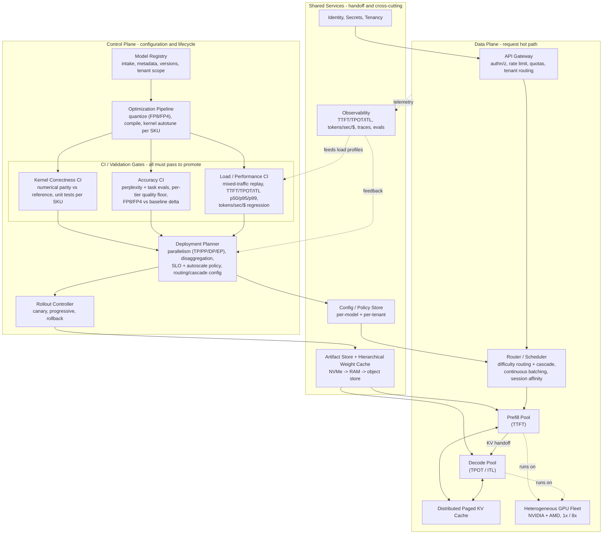
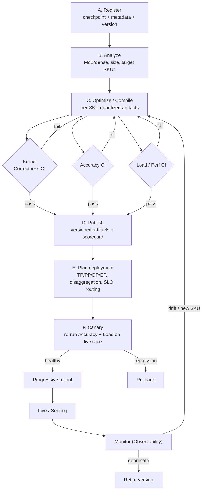

# System Design: Control Plane & Data Plane

A staff-level high-level system design for the Agentic Inference Cloud. It complements
[`DESIGN.md`](DESIGN.md) (which covers the kernel/precision/serving optimizations) by describing the
*platform* that turns a raw model checkpoint into a safely-served, SLO-governed inference endpoint.

The platform is split along the standard control-plane / data-plane boundary:

- **Control plane** - the slow path. Owns model configuration end to end (A-Z): intake, optimization,
  validation/CI, deployment planning, and rollout. It produces versioned, validated artifacts and
  configs. It is *not* in the per-request hot path.
- **Data plane** - the fast path. Serves inference requests against the artifacts the control plane
  published, under strict latency SLOs and multi-tenant isolation.

They are decoupled by **shared services**: an artifact store + hierarchical weight cache and a
config/policy store form the publish/consume handoff, while observability provides the feedback loop
from data plane back into control-plane decisions.

---

## 1. High-Level Architecture (Diagram A)

**Reading the diagram.** A model flows top-to-bottom through the control plane, is validated by three
independent CI gates, and is published as versioned artifacts + config into shared services. The data
plane consumes those at serving time. Telemetry closes the loop: production signals feed the
Deployment Planner (placement/autoscale decisions) and keep the Load CI traffic profiles realistic.

---

## 2. Control Plane - the A-Z model configuration lifecycle

| Stage | Component | Responsibilities |
|---|---|---|
| A. Intake | **Model Registry** | Register a checkpoint with metadata (architecture, size, license, owning tenant/visibility), assign an immutable version, record lineage. Source of truth for "what models exist." |
| B. Analysis | **Optimization Pipeline (analyze)** | Detect model class (MoE vs dense), parameter count, context length, and the set of target hardware SKUs (H200/B300, MI300X/MI325X/MI350X). |
| C. Optimize/compile | **Optimization Pipeline (build)** | Produce per-SKU artifacts: apply the precision ladder (FP8 default, FP4 where eligible), compile graphs, autotune kernels (Triton + vendor libs). One logical model -> N hardware-specific artifacts. |
| D. Validate | **CI / Validation Gates** | Kernel-correctness, accuracy, and load/performance gates (Section 3). Promotion requires all three to pass. |
| E. Plan | **Deployment Planner** | Choose the runtime config: parallelism layout (TP/PP/DP/EP), prefill/decode disaggregation, SLO targets, autoscaling policy, and routing/cascade thresholds, informed by Load CI numbers. |
| F. Roll out | **Rollout Controller** | Canary on a small traffic slice (re-running accuracy + load gates live), then progressive rollout with automated rollback on regression. Manages versions and safe retirement. |
| (cross) | **Config / Policy Store** | Holds per-model and per-tenant runtime configuration and policy, consumed by the data-plane router without a redeploy. |

The control plane is declarative and versioned: every model version carries its artifacts, validation
scorecard, and deployment config, so any rollout is reproducible and any rollback is a config pointer
change.

---

## 3. Validation & CI Pipeline

Three independent gates run on every model/config build. **All must pass to promote**, and the
accuracy + load gates re-run on canary against live traffic. This is how the platform *guarantees*
both the quality floor and the performance KPIs rather than hoping for them.

### 3.1 Kernel Correctness CI
- **What it does:** numerical-parity tests of every custom and quantized kernel against a trusted
  reference implementation, run per NVIDIA and AMD SKU, plus unit tests.
- **Why first:** catches miscompiles and bad autotuning configs before they can corrupt the accuracy
  or load results downstream. A kernel that is fast but wrong fails here.
- **Gate:** outputs must match reference within tight tolerance on every target SKU.

### 3.2 Accuracy CI (quality)
- **What it does:** evaluates the *built, quantized* model (not the original checkpoint) against a
  versioned eval set - perplexity plus task-level benchmarks (reasoning, long-context, tool/function
  calling) representative of each workload tier.
- **Key checks:**
  - **Per-tier quality-floor gate** - each workload tier has a minimum acceptable score.
  - **Quantization delta** - explicit FP8/FP4-vs-BF16-baseline comparison so low precision cannot
    silently degrade answers; regressions beyond a threshold fail the gate.
  - For the small model, two profiles are evaluated: its **standalone client-facing** quality (its own
    floor) and its **speculator** behavior (acceptance rate, which affects speed, not correctness).
- **Gate:** pass/fail plus a quality scorecard attached to the model version for audit and rollback.

### 3.3 Load / Performance CI (speed and cost)
- **What it does:** replays realistic mixed traffic against the actual serving stack on the target
  hardware - varied prompt/decode lengths, concurrency sweeps, multi-turn agentic patterns.
- **Measures:** **TTFT, TPOT, ITL at p50/p95/p99** (distributions, not averages) and **tokens/sec/$**.
- **Key checks:**
  - **SLO gate** - latency percentiles must meet the tier's targets at target concurrency.
  - **Cost/throughput regression** - tokens/sec/$ must not regress versus the previous version.
  - Produces the benchmark numbers the Deployment Planner uses to choose parallelism/placement.
- **Gate:** pass/fail against SLO and regression thresholds.

### 3.4 Shared test assets and feedback
- Eval datasets and load-generation profiles are **versioned artifacts**, so a result is always tied
  to a known test definition.
- **Observability feeds back** into the Load CI so traffic profiles track real production mixes (prompt
  length distributions, concurrency, agentic depth) and don't drift from reality.
- All results are stored per model version, enabling auditability and data-driven rollback decisions.

---

## 4. Model Onboarding Lifecycle (Diagram B)

Validation failures loop back to optimize/compile; a canary regression triggers rollback. Continuous
monitoring can re-trigger optimization (e.g., a new hardware SKU or quality drift) or retire a version.

---

## 5. Data Plane - the inference endpoint serving path

| Component | Responsibilities |
|---|---|
| **API Gateway** | Authentication/authorization, per-tenant rate limits and quotas, request validation, tenant identification for downstream isolation. |
| **Router / Scheduler** | The brain of the hot path: difficulty-based routing + cascade/escalation (§3.4 of `DESIGN.md`), continuous batching, session affinity, and SLO-aware placement. Reads live config from the Config/Policy Store. |
| **Prefill Pool** | Compute-bound prompt processing; optimizes TTFT; writes KV to the cache and hands off to decode. |
| **Decode Pool** | Memory-bound token generation; optimizes TPOT/ITL; runs continuous batching. |
| **Distributed Paged KV Cache** | Tiered (HBM -> CPU RAM -> NVMe) per-tenant KV and prefix cache; enables reuse and large effective batches. |
| **Heterogeneous GPU Fleet** | NVIDIA + AMD nodes in 1x/8x slugs; the Deployment Planner maps each model's parallelism plan onto appropriate SKUs. |

The data plane never makes model-configuration decisions itself; it executes the validated artifacts
and configs the control plane published, which keeps the hot path lean and predictable.

---

## 6. Cross-Cutting Concerns

- **Multi-tenant isolation:** identity/tenancy is enforced at the gateway and threaded through routing,
  caching (no cross-tenant cache reuse), and placement. See `DESIGN.md` Section 5.
- **Versioning & rollback:** every model version is immutable with its artifacts + validation
  scorecard; rollout/rollback is a config pointer change, not a rebuild.
- **SLO-driven autoscaling:** observability drives predictive scaling and warm pools (cold-start
  mitigation, `DESIGN.md` Section 4.1) so capacity tracks demand without violating SLOs.
- **Secrets & supply chain:** model artifacts and configs are signed/verified; the optimization
  pipeline and CI run in controlled environments to protect the integrity of what reaches production.

For the underlying optimization rationale (precision ladder, parallelism placement, disaggregation,
caching, telemetry), see [`DESIGN.md`](DESIGN.md). For all diagrams in one place, see
[`docs/diagrams.md`](docs/diagrams.md).
