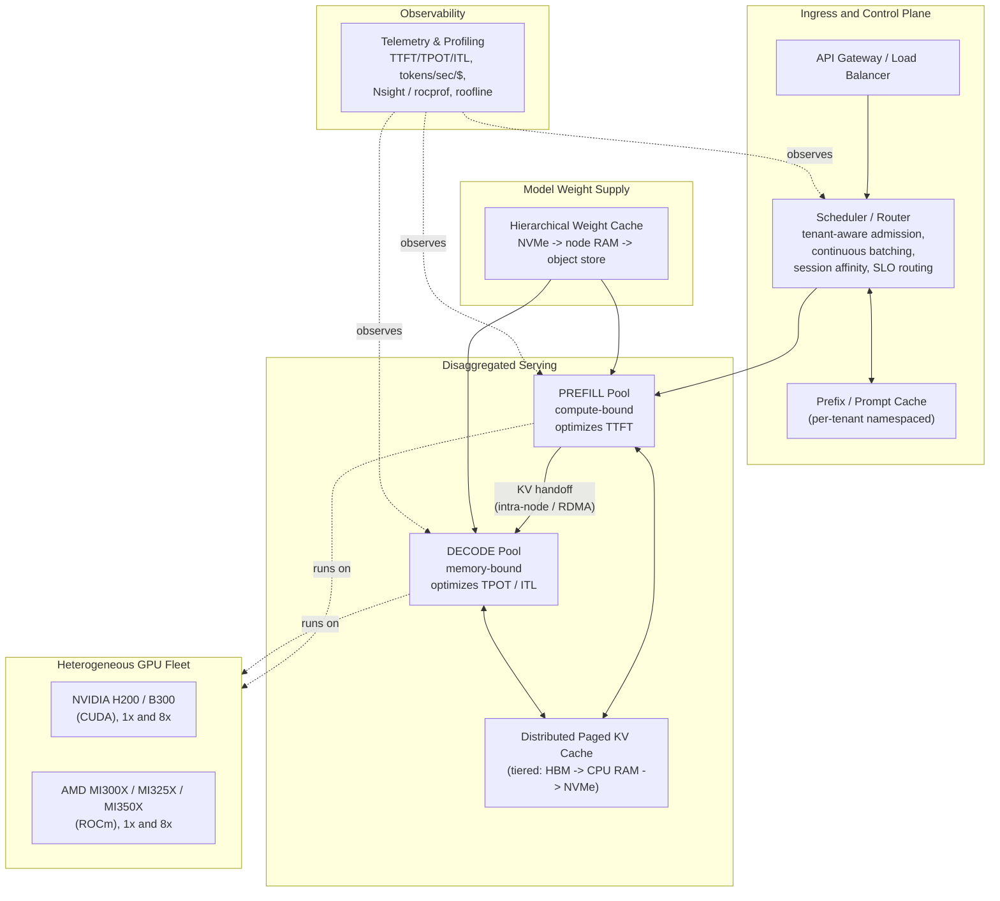
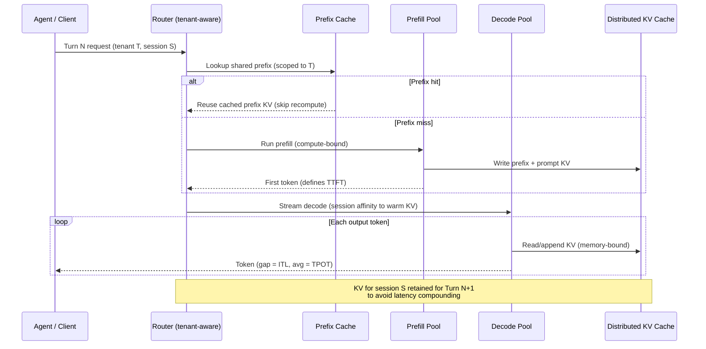
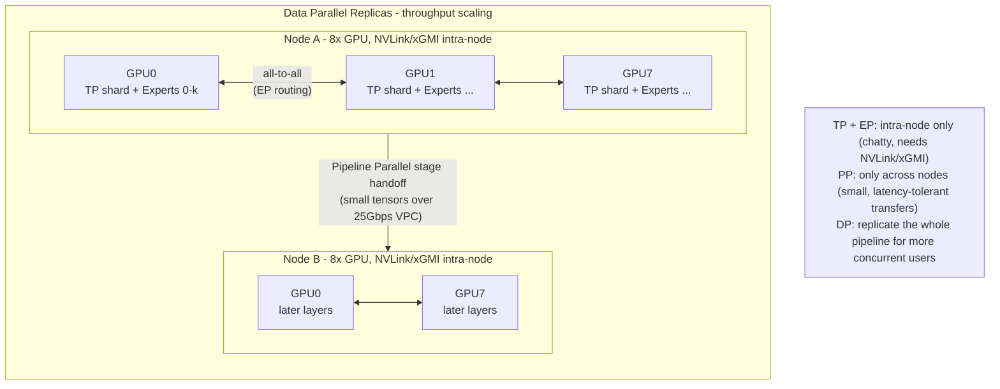
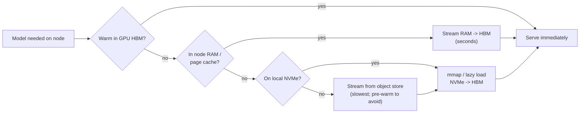

# Architecture Diagrams

Full-size Mermaid diagrams for the inference optimization design. These render natively on GitHub.
A condensed subset is inlined in [`../DESIGN.md`](../DESIGN.md).

---

## 1. System Architecture

End-to-end view: ingress and routing, disaggregated prefill/decode pools, the distributed KV and
prefix caches, the hierarchical model-weight cache, and the heterogeneous GPU fleet underneath.

---

## 2. Request Lifecycle - Multi-Turn Agentic Workflow

Shows where time goes (TTFT vs TPOT), how a prefix-cache hit and KV reuse short-circuit work, and
why disaggregation lets the two phases scale independently.

---

## 3. Parallelism Layout - 200B+ MoE Model

How a Mixture-of-Experts model is mapped onto hardware: Tensor + Expert Parallelism kept *inside*
a node over the fast interconnect, with Pipeline Parallelism used only to cross node boundaries.
Data Parallelism replicates the whole unit for throughput.

---

## 4. Cold-Start Mitigation - Hierarchical Weight Loading

The fallback path when a 100GB+ model must be made ready, fastest tier first.

